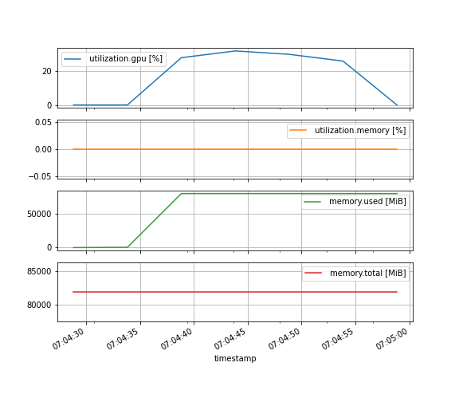

# Monitoring

In this section, we will explore multiple ways to monitor hte activity of a job while it is running.

## Live log file monitoring

So far, we looked at the content of the log file at the end using the `cat` command.
Wouldn't it be great if we could see in "real time" the content of this file?

To achieve, we will use the `tail` command with a little twist 🪄.

The `tail` command prints by default the last lines of a file.
Let's try this on one of our log files, for example (replace `44349268` with any of your jobs ID):

```bash
tail slurm-44349268.out
```

??? success "output"

    ```
    Epoch 2/5
    1563/1563 [==============================] - 4s 3ms/step - loss: 1.1781 - accuracy: 0.5816 - val_loss: 1.1526 - val_accuracy: 0.5874
    Epoch 3/5
    1563/1563 [==============================] - 4s 3ms/step - loss: 1.0207 - accuracy: 0.6384 - val_loss: 1.0523 - val_accuracy: 0.6281
    Epoch 4/5
    1563/1563 [==============================] - 4s 3ms/step - loss: 0.9263 - accuracy: 0.6742 - val_loss: 0.9380 - val_accuracy: 0.6695
    Epoch 5/5
    1563/1563 [==============================] - 4s 3ms/step - loss: 0.8484 - accuracy: 0.7035 - val_loss: 0.9007 - val_accuracy: 0.6905
    313/313 - 0s - loss: 0.9007 - accuracy: 0.6905 - 403ms/epoch - 1ms/step
    test accuracy: 0.690500020980835
    ```

But using the `-f` option, the `tail` command will keep watching the file and print updates to the file as they happen.

Let's run a new job to illustrate this, using one of our job scripts from the [previous section](submit.md):

```bash
sbatch train_model_env.sl
```

??? success "output"

    ```
    Submitted batch job 44392266
    ```

Double check that your job is running with `squeue --me`:

```bash
squeue --me
```

??? success "output"

    ```
    JOBID         USER     ACCOUNT   NAME        CPUS MIN_MEM PARTITI START_TIME     TIME_LEFT STATE    NODELIST(REASON)    
    44348624      riom     nesi99999 spawner-jupy   2      4G interac 2024-03-12T1     1:58:27 RUNNING  wbn001              
    44392266      riom     nesi99991 train_model_   2      8G hgx     2024-03-12T2        9:56 RUNNING  wmg003
    ```

And then open the log file using `tail -f` (replace `44392266` with your job ID):

```
tail -f slurm-44392266.out
```

!!! warning

    The `tail -f` command will not end, even once the job has finished.
    To get the command line prompt back, you need to interrupt it using ++ctrl+c++.

## Tensorboard

[TensorBoard](https://www.tensorflow.org/tensorboard) is a powerful visualisation tool that let's you track  and display various metrics while a model is being trained.
It's a web application, meaning that its interface is accessible via your web browser.

To use it, you need to make sure that your code save logs in the right format.
In our example script `training_model.py`, this is handled by the TensorBoard callback:

```python
tensorboard_callback = tf.keras.callbacks.TensorBoard(
    log_dir=output_folder / "logs", histogram_freq=1
)
history = model.fit(
    train_images,
    train_labels,
    epochs=5,
    validation_data=(test_images, test_labels),
    callbacks=[tensorboard_callback]
)
```

Here, we decided to save the TensorBoard logs in a sub-folder `logs` of the job result folder.


Before running it on a live job, let's use it to look at the metrics from a previous job (replace `44393779_train_model_env.sl` with one of your results folder):

```bash
module purge
module load TensorFlow/2.13.0-gimkl-2022a-Python-3.11.3
tensorboard --logdir 44393779_train_model_env.sl/logs/
```

??? success "output"

    ```
    2024-03-13 00:04:50.888636: I tensorflow/core/platform/cpu_feature_guard.cc:182] This TensorFlow binary is optimized to use available CPU instructions in performance-critical operations.
    To enable the following instructions: AVX2 FMA, in other operations, rebuild TensorFlow with the appropriate compiler flags.
    2024-03-13 00:04:53.655259: E tensorflow/compiler/xla/stream_executor/cuda/cuda_driver.cc:268] failed call to cuInit: CUDA_ERROR_UNKNOWN: unknown error
    Serving TensorBoard on localhost; to expose to the network, use a proxy or pass --bind_all
    TensorBoard 2.13.0 at http://localhost:6006/ (Press CTRL+C to quit)
    ```

Now TensorBoard is running *locally* in your session, on port 6006 (default value).
But you are using a *remote* session, so opening http://localhost:6006/ in your browser won't work 😢.

Fortunately, JupyterLab -- the interface you are currently using to access the platform -- can proxy web applications if you access it via a special proxy url:

```
https://jupyter.nesi.org.nz/user-redirect/proxy/PORTNUMBER/
```

for an application running on port `PORTNUMBER`.

In our case, this would be [https://jupyter.nesi.org.nz/user-redirect/proxy/6006/](https://jupyter.nesi.org.nz/user-redirect/proxy/6006/){:target="_blank"}.

!!! warning

    The final slash `/` character in the url is important.
    If you forget it, you will see a white empty page.

!!! failure

    If someone else is already running an application on port 6006 on the same node as you, TensorBoard will crashe with the following message:

    ```
    Address already in use
    Port 6006 is in use by another program. Either identify and stop that program, or start the server with a different port.
    ```

    To avoid this issue, select another port using the `--port` option, for example using port 25601 (replace `44393779_train_model_env.sl` with one of your results folder):

    ```bash
    tensorboard --logdir 44393779_train_model_env.sl/logs/ --port 25601
    ```

    and change the proxy url accordingly.

Like `tail -f`, the `tensorboard` command does not end by itself.
Press ++ctrl+c++ to interrupt it and get the command line prompt back.

!!! info

    To illustrate how to use TensorBoard in live mode, we need to increase the runtime of our Slurm jobs.

    Edit your copy of `train_model.py` to increase the number of epochs from 5 to 30.
    
    ```bash
    nano /nesi/project/nesi99991/introhpc2403/$USER/train_model.py
    ```

Interestingly, TensorBoard can be used while a job is running and writing information in its corresponding `logs` folder.

Let's give it a try! Submit a new training job:

```bash
sbatch train_model_env.sl
```

??? success "output"

    ```
    Submitted batch job 44394400
    ```

Then, as soon as the output folder is created, start the `tensorboard` command (replace `44394400_train_model_env.sl` with your job result folder):

```
tensorboard --logdir 44394400_train_model_env.sl/logs/
```

and open the proxy url [https://jupyter.nesi.org.nz/user-redirect/proxy/6006/](https://jupyter.nesi.org.nz/user-redirect/proxy/6006/){:target="_blank"}.

To enable live update in the web interface, click on the cogwheel icon (top right) and then tick the option **Reload Data**.


!!! info

    Make sure to edit your copy of `train_model.py` to decrease the number of epochs back to 5.

    ```bash
    nano /nesi/project/nesi99991/introhpc2403/$USER/train_model.py
    ```

## GPU usage

Another aspect which is import to monitor is how well the GPU is used while running the training code.
This can help diagnose simple errors (e.g. the code is not running on the GPU) as weel as tune some hyperparameters (e.g. increase the batch size).

Here, we will rely on `nvidia-smi` to collect information in a .csv file, while our job is running.

Edit one of your job submission scripts, for example:

```bash
nano train_model_env.sl
```

and insert the following command at the beginning instead of `nvidia-smi`:

```bash
# monitor GPU usage
nvidia-smi --query-gpu=timestamp,utilization.gpu,utilization.memory,memory.used,memory.total \
    --format=csv,nounits -l 5 > "gpustats-${SLURM_JOB_ID}.csv" &
```

??? example "train_model_env.sl (monitored)"

    ```bash linenums="1"
    --8<-- "train_model_env_monitor.sl"
    ```

This will make  `nvidia-smi` output every 5 seconds (`-l 5`) a series of measures to a .csv file.

!!! info "See also"

    More details about available metrics and their meaning is available in [Nvidia documentation](https://nvidia.custhelp.com/app/answers/detail/a_id/3751/~/useful-nvidia-smi-queries).

Then, let's submit a job:

```bash
sbatch train_model_env.sl
```

??? success "output"

    ```
    Submitted batch job 44409149
    ```

And, once the job finished, look at the generated .csv (replace `44409149` with your job ID):

```bash
cat gpustats-44409149.csv
```

??? success "output"

    ```
    timestamp, utilization.gpu [%], utilization.memory [%], memory.used [MiB], memory.total [MiB]
    2024/03/13 07:04:28.836, 0, 0, 0, 81920
    2024/03/13 07:04:33.838, 0, 0, 445, 81920
    2024/03/13 07:04:38.839, 28, 0, 80257, 81920
    2024/03/13 07:04:43.843, 32, 0, 80257, 81920
    2024/03/13 07:04:48.844, 30, 0, 80257, 81920
    2024/03/13 07:04:53.846, 26, 0, 80257, 81920
    2024/03/13 07:04:58.849, 0, 0, 80257, 81920
    ```

This is a nice pile of number, wouldn't be nicer to turn it into a plot 😉?

Let's do this using a little bit of Python.
Open a new *Console*[^1] in JupyterLab and use the following commands (replace the file path with your .csv file):

[^1]: In the *File* menu, under *New*, click on *Console* and then select the kernel `Python 3.10.5 (gimkl-2022a)`.

```python
import pandas as pd
statsfile = "/nesi/project/nesi99991/introhpc2403/riom/gpustats-44409149.csv"
dset = pd.read_csv(statsfile, parse_dates=True, index_col="timestamp")
dset.plot(subplots=True, figsize=(10, 9), grid=True)
```


