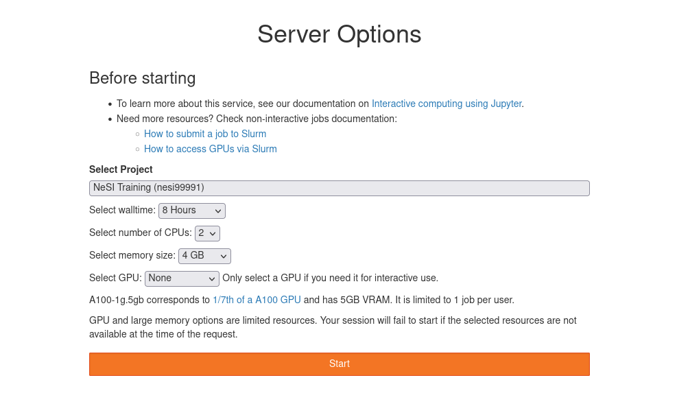

# Workshop Setup

During this workshop we will be running the material on the NeSI platform, using the [Jupyter-on-NeSI](https://jupyter.nesi.org.nz) service.
This section will walk you through the steps to start a session and checking that the workshop material is ready for you.

## Connect to Jupyter on NeSI

1. Open [https://jupyter.nesi.org.nz](https://jupyter.nesi.org.nz){:target="_blank"} in your web browser.
2. Enter your NeSI username, HPC password and 6 digit second factor token (as set on [MyNeSI](https://my.nesi.org.nz/account/hpc-account)).<br>
   
3. Choose server options as below.<br>
   

    !!! warning

        Make sure to choose the correct project code `nesi99991`, number of CPUs **2**, memory **4GB** and GPU **None** prior to pressing the button {width="60" .vertical}.

4. Start a terminal session from the JupyterLab launcher.<br>
   {width="500"}
5. And *voilà*! You are ready to go 😄.

!!! note

    All commands listed in the workshop will be entered in this terminal.

## Workshop material copy

This workshop material comes with a set of example scripts and notebook.
You should have a copy of it waiting for you in the workshop folder, let's check this.

It is located in the folder `/nesi/project/nesi99991/20240314__hpc_intro_dl/$USER`, where `$USER` stands for your NeSI login.

Let's move to this folder and check the content using:

```bash
cd /nesi/project/nesi99991/20240314__hpc_intro_dl/$USER
ls -l .
```

!!! info

    If, by any chance, you don't have a copy of the workshop material on the system, you can create one yourself using the following commands:
    
    ```bash
    git clone https://github.com/nesi/hpc-intro-dl.git /nesi/project/nesi99991/20240314__hpc_intro_dl/$USER
    ```
