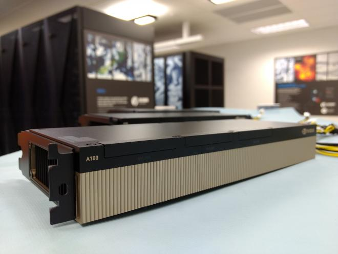

# Submit Batch Jobs

This section details how to request access to a GPU (graphics processing unit) on NeSI for batch jobs.
We will also see how to make sure that the installed deep learning packages properly find and use them.

## Available GPUs



GPU are dedicated piece of hardware filled with specialised compute units to handle massively parallel computations[^1].
The massively parallel architecture of deep learning models make them well-suited to run on GPUs, drastically decreasing their training time.

[^1]: Recent cards from NVIDIA have even more dedicated processing units, *[Tensor Cores](https://www.nvidia.com/en-us/data-center/tensor-cores/)*, that massively accelerate lower-precision matrix-matrix multiplications.

NeSI HPC platform gives access to different types of GPUs.
Here is a little tour of the available capacity as of March 2024:

GPU type | Location | Access type
---------|----------|------------
9 NVIDIA Tesla P100 PCIe 12GB cards (1 node with 1 GPU, 4 nodes with 2 GPUs) | Mahuika | Slurm and Jupyter
5 NVIDIA Tesla P100 PCIe 12GB cards (5 nodes with 1 GPU) | Māui Ancil. | Slurm
7 A100-1g.5gb instances (1 NVIDIA A100 PCIe 40GB card divided into 7 MIG GPU slices with 5GB memory each)| Mahuika | Slurm and Jupyter
7 NVIDIA A100 PCIe 40GB cards (4 nodes with 1 GPU, 2 nodes with 2 GPUs) | Mahuika | Slurm
4 NVIDIA HGX A100 boards (4 GPUs per board with 80GB memory each, 16 A100 GPUs in total)| Mahuika | Slurm

Which one should you use?

- for small experimentations, start with a A100-1g.5gb or a P100,
- if you need to run legacy code (e.g. TensorFlow 1.x) try a P100,
- otherwise use the PCIe or HGX A100,
- and if you need large memory and/or multiple GPUs, use the HGX A100s.

??? info "Limits on GPU Jobs"

    - Per-project limit of 6 GPUs being used at a time.
    - Per-project limit of 360 GPU-hours being allocated to running jobs.
      For example, you can use 8 GPUs at a time if your jobs run for a day, but only two GPUs if your jobs run for a week.
    - No more than 64 CPUs per GPU job, to ensure that GPUs are not left idle due to lack of free CPUs.
    - Per-user limit of one A100-1g.5gb GPU job.

## Slurm job submission

When preparing our Slurm job script, we need to make sure we tell Slurm that we need a GPU, using
the `--gpus-per-node` option.
In a job submission script, the syntax is the following:

```bash
#SBATCH --gpus-per-node=<gpu_type>:<gpu_number>
```

Depending on the GPU type, we *may* also need to specify a partition using `--partition`.

GPU type | Slurm option
---------|-------------
Mahuika P100 | <pre><code>#SBATCH --gpus-per-node=P100:1</code></pre>
Māui Ancil. P100 | <pre><code>#SBATCH --partition=nesi_gpu<br>#SBATCH --gpus-per-node=1</code></pre>
A100-1g.5gb | <pre><code>#SBATCH --gpus-per-node=A100-1g.5gb:1</code></pre>
PCIe A100 (40GB) | <pre><code>#SBATCH --gpus-per-node=A100:1</code></pre>
HGX A100 (80GB) | <pre><code>#SBATCH --partition=hgx<br>#SBATCH --gpus-per-node=A100:1</code></pre>
Any A100 🚀 | <pre><code>#SBATCH --partition=hgx,gpu<br>#SBATCH --gpus-per-node=A100:1</code></pre>

For today's exercises, we will use a big one 🤯, an HGX A100 GPU.

Let's start with a very simple batch job, printing simple information about the requested GPU:

```bash title="gpujob.sl" linenums="1"
#!/usr/bin/env bash
#SBATCH --account=nesi99991
#SBATCH --time=00:10:00
#SBATCH --cpus-per-task=2
#SBATCH --mem=1GB
#SBATCH --partition=hgx
#SBATCH --gpus-per-node=A100:1

# display information about the available GPUs
nvidia-smi

# check the value of the CUDA_VISIBLE_DEVICES variable
echo "CUDA_VISIBLE_DEVICES=${CUDA_VISIBLE_DEVICES}"
```

Create the file `gpujob.sl` in your workshop folder, for example using the nano editor:

```bash
cd /nesi/project/nesi99991/introhpc2403/$USER
nano gpujob.sl
```

Then let's submit the job using `sbatch`:

```bash
sbatch gpujob.sl
```

??? success "output"

    ```
    Submitted batch job 44344744
    ```

You can check the state of all your jobs using `squeue --me`.
Once completed, chech the content of the Slurm log file (replace `44344744` with your job ID):

```
cat slurm-44344744.out
```

??? success "output"

    ```
    Tue Mar 12 09:38:23 2024
    +-----------------------------------------------------------------------------+
    | NVIDIA-SMI 525.85.12    Driver Version: 525.85.12    CUDA Version: 12.0     |
    |-------------------------------+----------------------+----------------------+
    | GPU  Name        Persistence-M| Bus-Id        Disp.A | Volatile Uncorr. ECC |
    | Fan  Temp  Perf  Pwr:Usage/Cap|         Memory-Usage | GPU-Util  Compute M. |
    |                               |                      |               MIG M. |
    |===============================+======================+======================|
    |   0  NVIDIA A100-SXM...  On   | 00000000:C7:00.0 Off |                    0 |
    | N/A   35C    P0    62W / 400W |      0MiB / 81920MiB |      0%      Default |
    |                               |                      |             Disabled |
    +-------------------------------+----------------------+----------------------+

    +-----------------------------------------------------------------------------+
    | Processes:                                                                  |
    |  GPU   GI   CI        PID   Type   Process name                  GPU Memory |
    |        ID   ID                                                   Usage      |
    |=============================================================================|
    |  No running processes found                                                 |
    +-----------------------------------------------------------------------------+
    CUDA_VISIBLE_DEVICES=0
    ```

Note that `nvidia-smi` and `CUDA_VISIBLE_DEVICES` both report one GPU.

!!! question "Exercise"

    1. Try to request 2 HGX A100 and compare the output of the log file.
    2. Remove the `--partition` and `--gpus-per-node` options and compare the results.

!!! warning

    As we have just seen, Slurm set the environment variable `CUDA_VISIBLE_DEVICES` for you, so you don't need to do it.

## TensorFlow example

TODO

## CUDA/cuDNN modules and other subtleties

TODO when to load CUDA/cuDNN, which versions?
- env module vs. conda vs. container
- PyTorch: no cudnn? no cuda?

TODO TF: XLA compiler

TODO check the logs about GPU usage

TODO apptainer --nv
